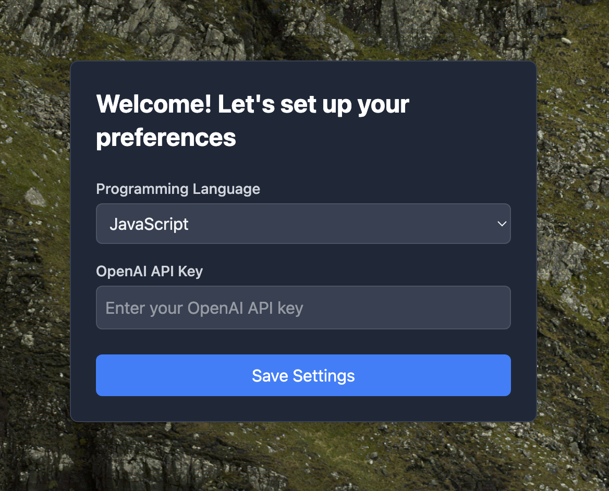
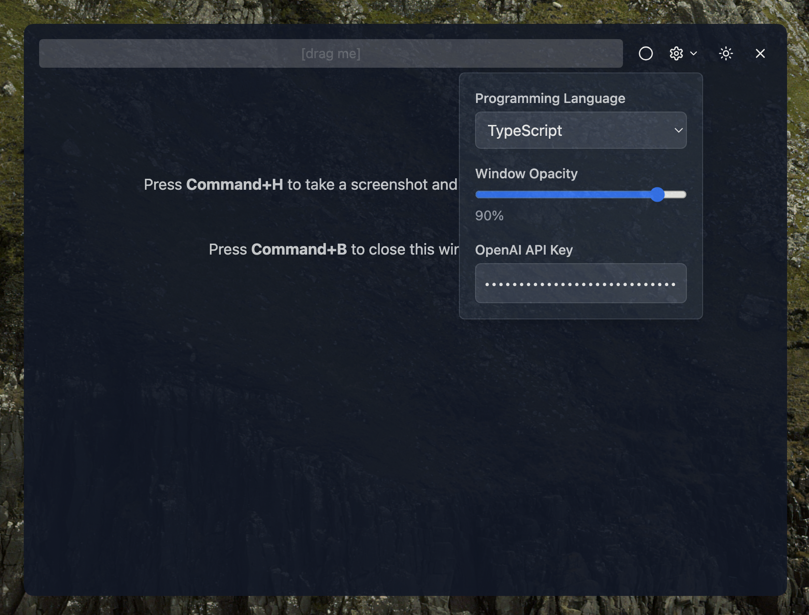
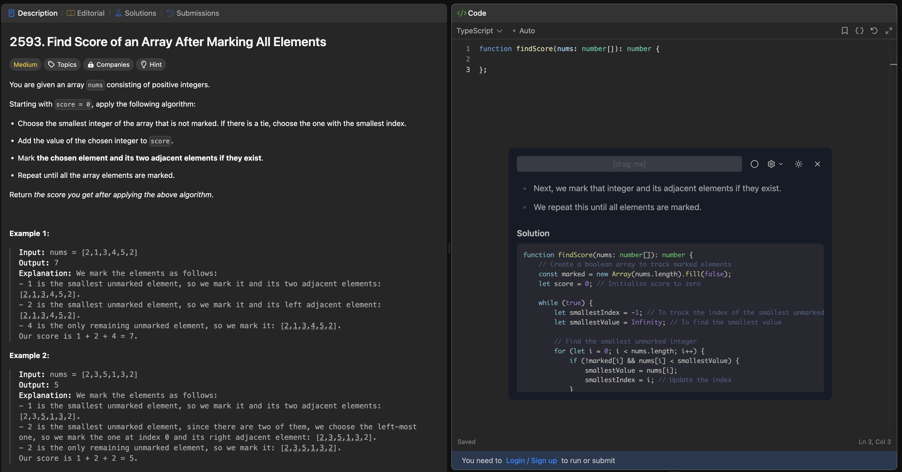

# Interview Whisperer 🎤🤫

Your secret AI companion for software coding interviews! Interview Whisperer is an Electron-based desktop application that helps you prepare for and navigate technical coding interviews with the power of AI. It's like having a senior developer whispering solutions in your ear - but in a completely ethical way, of course! 😉

## Features

- 🎯 Real-time AI assistance during coding interviews
- 💻 Code completion and optimization suggestions
- 🖥️ Invisible window during screen sharing
- 📸 Quick screenshot capture (Command+H)
- 👁️ Toggle window visibility (Command+B)
- 🤖 Powered by OpenAI's ChatGPT
- 🎨 Modern UI with Tailwind CSS
- ⚡ Fast and responsive

## Screenshots

### Welcome Screen



### Main Application View



### Solution



## Installation

```bash
# Clone the repository
git clone https://github.com/yourusername/interview-whisperer.git
cd interview-whisperer

# Install dependencies
npm install

# Start the development server
npm run dev

# Build the application
npm run build

# Compile for production
npm run compile
```

## Development

This project uses a monorepo structure with workspaces. The main components are:

- Electron main process
- React frontend
- TypeScript for type safety
- Tailwind CSS for styling

### Available Scripts

- `npm run dev` - Start the development server
- `npm run build` - Build all workspace packages
- `npm run compile` - Build and compile the Electron application

## Usage

1. Start the application
2. Enter your OpenAI API key in the settings
3. During an interview:
   - Use Command+H to capture screenshots
   - The AI window remains invisible during screen sharing
   - Get real-time assistance from ChatGPT

## Contributing

We welcome contributions! Please feel free to submit a Pull Request.

## License

This project is open source and available under the MIT License.

## Disclaimer

This tool is intended for educational purposes and interview preparation. Please use it responsibly and in accordance with your company's policies and interview guidelines.
